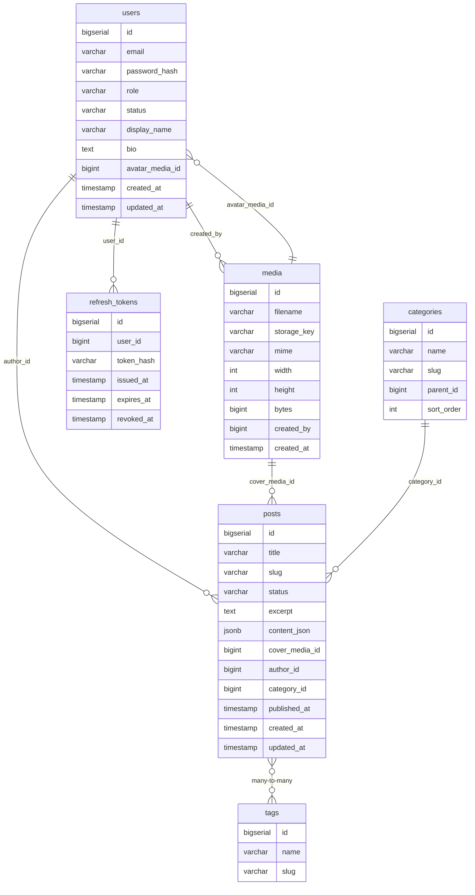
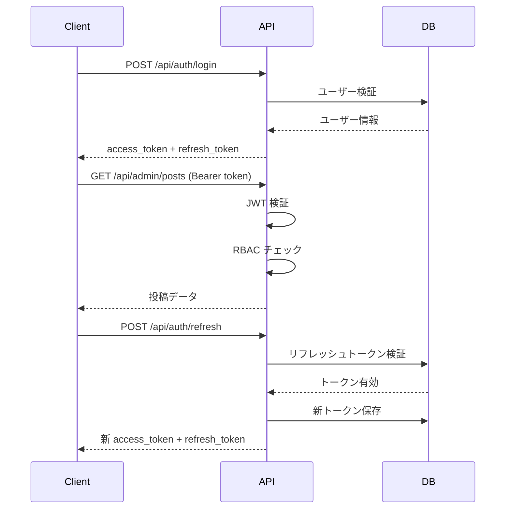

[]()
[]()
[]()
[]()

# PostFlow Backend - エンタープライズ CMS API

**Spring Boot 3.5 によるモダン RESTful API**

## 特徴

-   **モダンアーキテクチャ**: Spring Boot 3.5 + Java 21 + PostgreSQL
-   **品質保証**: JaCoCo 85%/70% カバレッジ、246 テストケース
-   **セキュリティ**: JWT 認証 + RBAC + OWASP ベース設計
-   **スケーラブル**: AWS 3 層構成対応 (ECS Fargate / RDS / S3)

## 技術スタック

### コアフレームワーク

-   **Spring Boot 3.5.5**: 最新の Spring フレームワーク
-   **Java 21**: 最新 LTS バージョン
-   **Maven**: ビルドツール

### 認証・認可

-   **JWT**: アクセストークン(15 分) + リフレッシュトークン(7 日)
-   **RBAC**: ロールベースアクセス制御 (ADMIN/EDITOR/AUTHOR)
-   **BCrypt**: パスワードハッシュ化

### データ層

-   **PostgreSQL 15**: リレーショナルデータベース
-   **Spring Data JPA**: ORM
-   **Flyway**: データベースマイグレーション

### メディアストレージ

-   **S3 互換**: MinIO / Amazon S3 対応
-   **Presigned URL**: セキュアなファイルアクセス

### テスト

-   **JUnit 5**: テストフレームワーク
-   **MockMvc**: コントローラー統合テスト
-   **AssertJ**: 流暢なアサーション
-   **JaCoCo**: カバレッジ測定

## プロジェクト構成

```
src/
├── main/
│   ├── java/com/example/backend/
│   │   ├── batch/           # スケジュールタスク
│   │   ├── config/          # 設定クラス
│   │   ├── controller/      # REST コントローラー
│   │   │   ├── admin/       # 管理者向け API
│   │   │   ├── open/        # 認証不要 API
│   │   │   └── pub/         # 公開 API
│   │   ├── dto/             # データ転送オブジェクト
│   │   ├── entity/          # JPA エンティティ
│   │   ├── exception/       # カスタム例外
│   │   ├── repository/      # データアクセス層
│   │   ├── security/        # 認証・認可
│   │   │   ├── jwt/         # JWT 処理
│   │   │   └── policy/      # RBAC ポリシー
│   │   └── service/         # ビジネスロジック
│   └── resources/
│       ├── db/migration/    # Flyway マイグレーション
│       ├── db/seed/         # シードデータ
│       └── application.properties
└── test/                    # 246 テストケース
```

## データベース設計

### ERD (主要エンティティ)



## RBAC（Role-Based Access Control）

| リソース     |           ADMIN           |    EDITOR    |              AUTHOR              |
| ------------ | :-----------------------: | :----------: | :------------------------------: |
| Posts        |       ○ 全件操作可        | ○ 全件操作可 | △ 自分の投稿のみ編集可／公開不可 |
| Media        |       ○ 全件操作可        | ○ 全件操作可 |     △ 自分のアップロードのみ     |
| Categories   |             ○             |      ○       |                ✕                 |
| Tags         |             ○             |      ○       |                ✕                 |
| Users        | ○（管理者自信は削除不可） |      ✕       |                ✕                 |
| Self Profile |        ○ 自分のみ         |  ○ 自分のみ  |            ○ 自分のみ            |

### 実装

-   **Policy 層**: `PostPolicy`, `MediaPolicy`, `CategoryPolicy`, `TagPolicy`, `UserPolicy`
-   **Service 層**: Policy を呼び出して認可チェック
-   **コントローラー層**: `@PreAuthorize` でロールチェック

## API エンドポイント

### 公開 API (`/api/public`)

-   `GET /posts` - 投稿一覧
-   `GET /posts/{slug}` - 投稿詳細
-   `GET /categories` - カテゴリ一覧
-   `GET /tags` - タグ一覧

### 認証 API (`/api/auth`)

-   `POST /login` - ログイン
-   `POST /refresh` - トークンリフレッシュ
-   `POST /logout` - ログアウト

### 管理者 API (`/api/admin`)

-   `POST /posts` - 投稿作成
-   `PUT /posts/{id}` - 投稿更新
-   `DELETE /posts/{id}` - 投稿削除
-   `POST /media` - メディアアップロード
-   `GET /media` - メディア一覧
-   `POST /categories` - カテゴリ作成
-   `POST /tags` - タグ作成
-   `GET /users` - ユーザー一覧
-   `POST /users` - ユーザー作成

## セキュリティ実装

### 多層防御アーキテクチャ

1. **JWT 認証**: アクセス(15 分) + リフレッシュ(7 日)トークン
2. **トークンローテーション**: リフレッシュ時に新トークン発行
3. **RBAC**: メソッドレベル認可制御
4. **入力検証**: Bean Validation + カスタムバリデータ
5. **例外処理**: `GlobalExceptionHandler` で統一エラーハンドリング
6. **パスワード**: BCrypt + ソルト

### JWT フロー



## セットアップ

### 前提条件

-   Java 21
-   Maven 3.8+
-   PostgreSQL 15+
-   MinIO または S3 (メディアストレージ)

### 環境変数

```bash
# データベース
SPRING_DATASOURCE_URL=jdbc:postgresql://localhost:5432/postflow
SPRING_DATASOURCE_USERNAME=postflow_user
SPRING_DATASOURCE_PASSWORD=postflow_pass

# アプリケーション
BASE_URL=http://localhost:8080

# S3/MinIO
S3_BUCKET=postflow-media
AWS_REGION=us-east-1
S3_ENDPOINT=http://localhost:9000
S3_PRESIGNER_ENDPOINT=http://localhost:9000
S3_ACCESS_KEY=minioadmin
S3_SECRET_KEY=minioadmin
S3_PUBLIC_BASE_URL=http://localhost:9000/postflow-media
APP_MEDIA_USE_IN_MEMORY=false

# JWT
JWT_SECRET=your-super-secret-jwt-key-change-this-in-production-min-256-bits
JWT_ACCESS_TTL=15m
JWT_REFRESH_TTL=7d

# デモリセット (オプション)
APP_DEMO_RESET_ENABLED=true
APP_DEMO_RESET_MINIMAL_SEED_ON_STARTUP=true
```

### ローカル起動

```bash
# 依存関係のインストール
./mvnw clean install

# アプリケーション起動
./mvnw spring-boot:run

# API アクセス確認
curl http://localhost:8080/api/public/posts
```

### シードデータ

#### 簡易シード（初回起動時・自動）

初回起動時に自動投入される最低限のデータ:

-   **ユーザー 3 名**: admin@example.com, editor@example.com, author@example.com (パスワード: `password123`)
-   **カテゴリ 2 件**: テクノロジー, ビジネス
-   **タグ 5 件**: Spring Boot, Next.js, AWS, Docker, PostgreSQL
-   **サンプル投稿 1 件**: ウェルカム投稿

#### フルシード（手動実行・開発用）

投稿 100 件・カテゴリ 10 件・タグ 30 件・メディア多数を投入:

```bash
# 1. ログイン
TOKEN=$(curl -s -X POST http://localhost:8080/api/auth/login \
  -H "Content-Type: application/json" \
  -d '{"email":"admin@example.com","password":"password123"}' \
  | jq -r '.accessToken')

# 2. フルシード実行
curl -X POST http://localhost:8080/api/admin/demo/reset-full \
  -H "Authorization: Bearer $TOKEN"
```

## テスト

### テスト実行

```bash
# 全テスト実行
./mvnw test

# 特定のテストクラス
./mvnw test -Dtest=PostServiceTest

# カバレッジレポート生成
./mvnw clean test
open target/site/jacoco/index.html
```

### テスト構成 (246 ケース)

-   **Unit Tests**: Service/Repository 層の単体テスト
-   **Integration Tests**: MockMvc によるコントローラーテスト
-   **Security Tests**: 認証・認可・Policy テスト
-   **Data Tests**: `TestDataConfig` + `TestClockConfig`

### カバレッジ基準

-   **Instructions**: ≥ 85%
-   **Branches**: ≥ 70%

## ビルド

```bash
# JAR ファイル生成
./mvnw clean package

# テストスキップ
./mvnw clean package -DskipTests

# 生成された JAR
ls -lh target/*.jar
```

## デプロイ

### 本番環境チェックリスト

-   [ ] `JWT_SECRET` を強力なランダム文字列に変更
-   [ ] データベース認証情報を本番用に変更
-   [ ] S3/MinIO の認証情報を本番用に変更
-   [ ] `BASE_URL` を本番ドメインに設定
-   [ ] `APP_DEMO_RESET_ENABLED=false` に設定
-   [ ] ログレベルを `INFO` 以上に設定
-   [ ] HTTPS/TLS を有効化

### AWS デプロイ (予定)

-   **ECS Fargate**: コンテナオーケストレーション
-   **RDS PostgreSQL**: マネージドデータベース
-   **S3**: メディアストレージ
-   **ALB**: ロードバランサー

## API ドキュメント

### HTTP ファイル

`http/` ディレクトリに REST Client 形式の API テストファイルを用意:

-   `public-api.http` - 公開 API
-   `post-api-admin.http` - 管理者向け投稿 API
-   `post-api-author.http` - 著者向け投稿 API
-   `post-api-editor.http` - 編集者向け投稿 API

### 使い方 (VS Code)

1. REST Client 拡張機能をインストール
2. `.http` ファイルを開く
3. リクエストの上にある "Send Request" をクリック

## トラブルシューティング

### データベース接続エラー

```bash
# PostgreSQL の起動確認
pg_isready -h localhost -p 5432

# データベース存在確認
psql -h localhost -U postflow_user -d postflow -c "\dt"
```

### Flyway マイグレーションエラー

```bash
# マイグレーション状態確認
./mvnw flyway:info

# マイグレーション修復
./mvnw flyway:repair
```

### JWT エラー

-   `JWT_SECRET` が 256 ビット以上あることを確認
-   トークンの有効期限が切れていないか確認

## 品質指標

-   **テストカバレッジ**: 85% (命令) / 70% (ブランチ)
-   **テストケース数**: 246 件
-   **実行時間**: 約 60 秒
-   **コミット運用**: 1 コミット 1 論理変更

## 開発プロセス

-   **戦略的テスト設計**: 統合テスト中心から始め、Security/S3 Media 層のユニットテスト追加により、カバレッジを 69%→85%へ改善
-   **継続的品質改善**: JaCoCo レポート分析による PDCA サイクル

## ライセンス

MIT License

## 連絡先

プロジェクト管理者: [@koichiro-38lab](https://github.com/koichiro-38lab)

---
